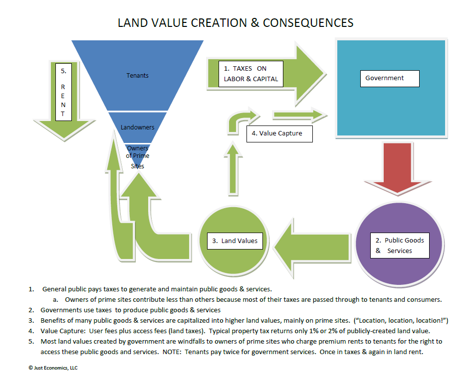
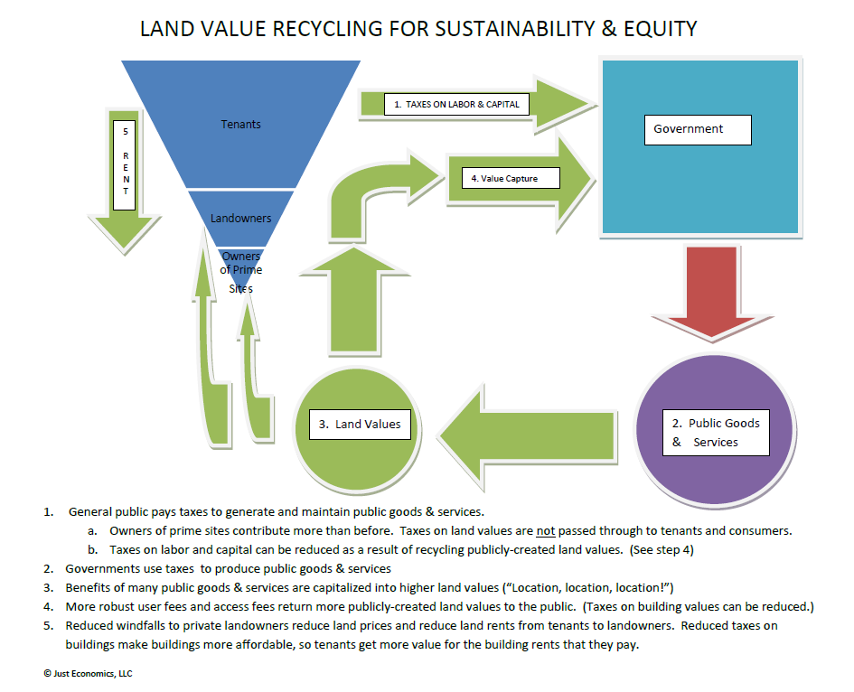

# Planning Mystery &#35;1
The Road to Gentrification is paved with Good Intentions
Presented by Rick Rybeck, Just Economics LLC

## Problem
Federal, state, and local governments want to uplift low-income communities.  For example, improving access to education, employment and shopping could be very helpful.  But if transportation improvements are well-planned and well-executed, the result is rising land prices and rents.  Rising land prices make it difficult to create affordable development near infrastructure.  As a result, some developers will build luxury housing and retail near new or improved transportation facilities and services displace the intended beneficiaries, enriching landowners – most of whom weren’t very poor in the first place.  Even policy improvements like reduced transit fares or increases in the minimum wage could result in higher rents.  Some communities, fearing this result, will refuse to make needed improvements in low-income neighborhoods.  In this environment, it seems that the road to gentrification is paved with good intentions.

## Assignment
What can each level of government do to ensure that the benefits of public programs and transportation facilities go to the intended beneficiaries and not to landowners? How can there be improvements to the transportation network that does not impact a person’s ability to remain in their neighborhood.

# Summary Report
*prepared by Pat Coleman*

* Federal, state, and local governments want to uplift low-income communities.
* Policy improvements like reduced transit fares or increases in the minimum wage could result in higher rents.
* What can each level of government do to ensure that the benefits of public programs and transportation facilities go to the intended beneficiaries and not to landowners?
* Tables facilitated by Veronica Davis and Richard Ezike

## Findings

* Richard Ezike presented:
  * Major points included Gentrification and how to tackle issue:  good, bad, etc.
  * Three steps toward a solution:  education, community organization, economic tools/land value tax, jobs/housing balance,
* Rick Rybeck presented:
  * Media only focuses on small part (rich displace poor)
  * Demolition by neglect is often forgotten –need to look at both sides of the coin
  * Ways to handle the issue include being more cognizant of zoning; inclusionary zoning, etc., bonus densities
  * CMAQ  a potential funding source
  * Rail versus bus transit – both are important;  the latter could lead to good outcomes without price speculation
  * Moderate rent control  a possibility – tied to spikes in value
  * A different approach – more money to public through value capture tax.

## Session Notes (Courtesy of Rick Rybeck and Richard Ezike)

### Issues of Gentrification

* Difficult to model and predict
* Transportation models do not include race in their calculations
* Diversity gets reduced as you force people out
  * Haley mentioned the US DOT is fully aware of this issue
* Cognitive dissonance on the people being affected
  * John mentioned MPOs are left off the hook regarding development because it is “good” and communities being “forced to move” just happens
  * Although TOD can be good, it should not be done if low-income people are hurt, but that’s not reality

The Question - Thinking big picture, how can we encourage development while investing in the people that are already in those areas (and not displace them)?

Solutions/Ideas to Move Forward

* Taxing Land vs Buildings (Rick suggestion)
  * Must tax land and buildings at different rates
    * Lower for privately-created building values
    * Higher for publicly-created land values
  * Shifting the tax burden off buildings, making them more affordable.
  * Surprisingly, a higher tax on land helps keep land prices more affordable also.
* Developing new land use models with progressive policies
  * Mandating inclusionary zoning
  * Taxing development around TOD, and funds going back into the infrastructure for improvement
  * Rent Control (for residential and commercial users)
* Incentivizing and empowering current residents to stay in their homes
  * Need education and organization in the community to understand gentrification process
  * Implementing property tax cap or taxes match inflation and no higher
  * Providing programs that allow senior citizens to age in place
* Adding legitimate transit options that work for the specific neighborhood
  * Bus improvements may be better than a fixed rail line
    * Can effectively meet transportation needs if well-managed
    * Less likely to generate land-price inflation

## Closing points from Rick Rybeck:

* Gentrification is a subset of economic displacement.  Although it is only the “tip of the iceberg,” it gets the lion’s share of attention.  “Demolition by neglect” probably displaces many more people, but receives little attention from the media.
* The property tax applied to privately-created building values makes buildings needlessly more expensive to construct, improve and maintain.  This reduces the supply of buildings, raises their price and reduces employment.  Some communities have shifted their property tax off of privately-created land values and onto publicly-created land values.  Although the same revenue is raised, the impact can be dramatic.  The lower tax on buildings makes them cheaper to construct, improve and maintain.  This is good for residents and businesses alike.  Surprisingly, the higher tax on land values helps reduce land prices as well.  (By reducing the profit from land speculation, it reduces the speculative demand for land.  Also, the price of land reflects the expected benefits from ownership.  These expected benefits are reduced when land taxes are increased.)  Shifting taxes off of buildings and onto land can help draw development to infrastructure while helping to make that development more affordable.
* In an urban context, land values reflect the quantity and quality of available public goods and services.  Thus taxing based on land values is more equitable to the extent that landowners who receive the most benefit pay in proportion to the benefit received.
* “Circuit breaker” and similar programs can help low-income homeowners avoid displacement due to rising property taxes.
* Rent control is not a long-term solution to the affordability and gentrification.  However, it can be a short-term measure that slows down economic displacement due to demand pressure from more affluent households.  
* Although rent control is typically used in residential contexts, it might be equally important to help preserve small, neighborhood-serving businesses in areas subject to gentrification pressures.

